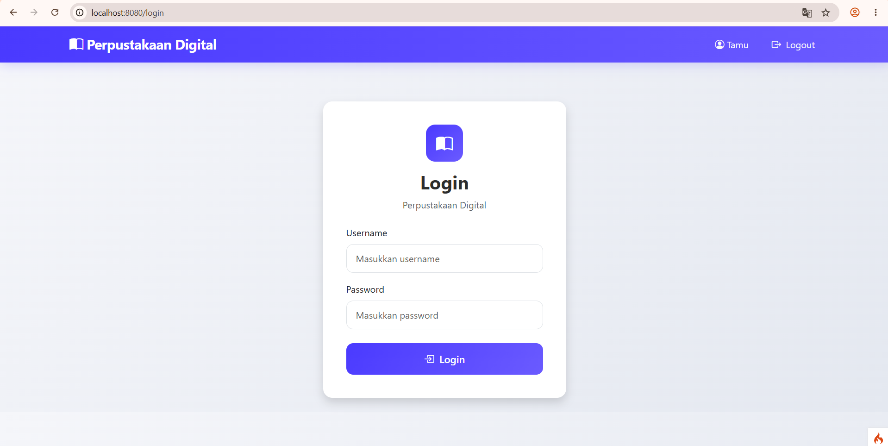
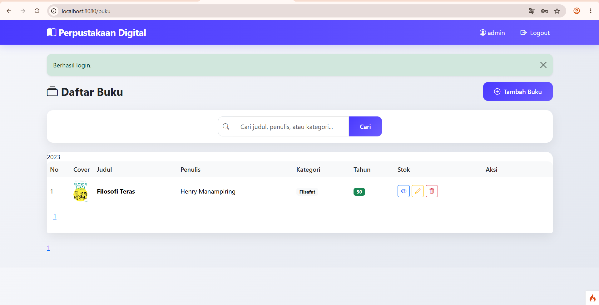
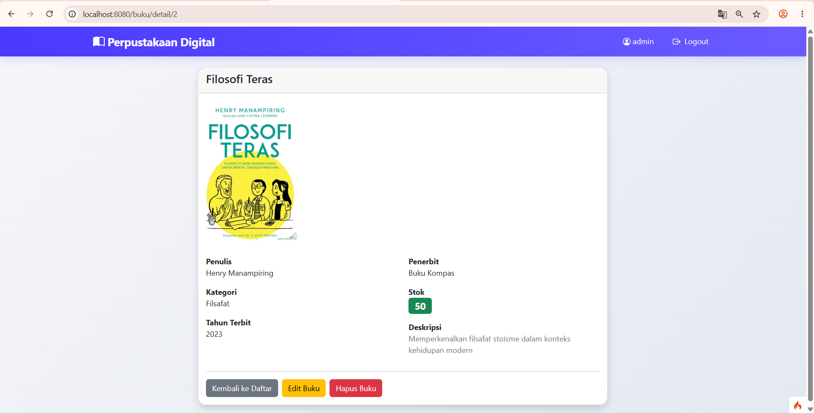
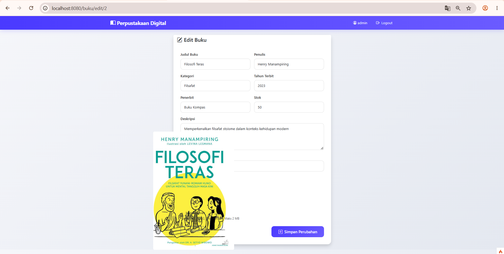

# LAPORAN APLIKASI PERPUSTAKAAN DIGITAL

## 📊 RINGKASAN PROYEK

**Nama Aplikasi:** Perpustakaan Digital  
**Framework:** CodeIgniter 4.7  
**Bahasa Pemrograman:** PHP 8.2  
**Database:** MySQL/MariaDB  
**Tanggal:** Agustus 2026  

---

## 🎯 TUJUAN APLIKASI

Aplikasi Perpustakaan Digital dirancang untuk memudahkan pengelolaan data buku secara digital. Sistem ini menyediakan antarmuka yang user-friendly untuk melakukan operasi CRUD (Create, Read, Update, Delete) pada data buku, dilengkapi dengan fitur autentikasi, pencarian, dan manajemen file gambar untuk cover buku.

---

## ⚙️ KONFIGURASI SISTEM

### Konfigurasi Web Server

```
Base URL        : http://localhost:8080/
Environment     : Development
Server          : PHP Built-in Server / Apache / Nginx
Document Root   : public/
Entry Point     : public/index.php
```

### Konfigurasi Database

```
Host            : localhost
Port            : 3306
Database Name   : perpustakaandigital
Username        : root
Password        : (kosong)
Driver          : MySQLi
Socket          : /tmp/mysql.sock
Character Set   : utf8mb4
Collation       : utf8mb4_general_ci
```

### Konfigurasi PHP

**Minimum Requirements:**
- PHP Version: 8.2 atau lebih tinggi
- Memory Limit: 128M (recommended)
- Upload Max Filesize: 2M (untuk cover buku)
- Post Max Size: 8M

**Required Extensions:**
- intl
- mbstring
- json
- mysqlnd (MySQL Native Driver)
- libcurl
- gd atau imagick (untuk image processing)

---

## 🗂️ STRUKTUR DATABASE

### Tabel 1: `users`

Tabel ini menyimpan data pengguna/admin yang dapat mengakses sistem.

```sql
CREATE TABLE users (
    id INT(11) UNSIGNED NOT NULL AUTO_INCREMENT,
    username VARCHAR(50) NOT NULL UNIQUE,
    password VARCHAR(255) NOT NULL,
    created_at TIMESTAMP NULL,
    PRIMARY KEY (id)
) ENGINE=InnoDB DEFAULT CHARSET=utf8mb4;
```

**Deskripsi Kolom:**
- `id`: Primary key, auto increment
- `username`: Username unik untuk login
- `password`: Password yang di-hash menggunakan bcrypt
- `created_at`: Timestamp pembuatan akun

**Data Default:**
- Username: `admin`
- Password: `admin123` (akan di-hash otomatis)

### Tabel 2: `buku`

Tabel ini menyimpan semua informasi tentang buku dalam perpustakaan.

```sql
CREATE TABLE buku (
    id INT(11) UNSIGNED NOT NULL AUTO_INCREMENT,
    judul VARCHAR(150) NOT NULL,
    penulis VARCHAR(100) NOT NULL,
    kategori VARCHAR(50) NOT NULL,
    tahun_terbit YEAR NOT NULL,
    penerbit VARCHAR(100) NOT NULL,
    stok INT NOT NULL,
    deskripsi TEXT NULL,
    cover VARCHAR(255) NULL,
    created_at TIMESTAMP NULL,
    updated_at TIMESTAMP NULL,
    PRIMARY KEY (id)
) ENGINE=InnoDB DEFAULT CHARSET=utf8mb4;
```

**Deskripsi Kolom:**
- `id`: Primary key, auto increment
- `judul`: Judul buku (max 150 karakter)
- `penulis`: Nama penulis buku (max 100 karakter)
- `kategori`: Kategori/genre buku (max 50 karakter)
- `tahun_terbit`: Tahun terbit buku (format YEAR)
- `penerbit`: Nama penerbit (max 100 karakter)
- `stok`: Jumlah stok buku yang tersedia
- `deskripsi`: Deskripsi detail buku (opsional)
- `cover`: Path file cover buku (opsional)
- `created_at`: Timestamp pembuatan record
- `updated_at`: Timestamp terakhir diupdate

---

## 🏗️ ARSITEKTUR APLIKASI

### Model-View-Controller (MVC)

Aplikasi ini menggunakan pola arsitektur MVC dari CodeIgniter 4:

#### **Models**
1. **UserModel** (`app/Models/UserModel.php`)
   - Mengelola data users
   - Auto-hash password sebelum insert
   - Validasi data pengguna

2. **BukuModel** (`app/Models/BukuModel.php`)
   - Mengelola data buku
   - Fitur pencarian (judul, penulis, kategori)
   - Validasi data buku
   - Automatic timestamps

#### **Controllers**
1. **Auth** (`app/Controllers/Auth.php`)
   - `login()`: Menampilkan form login
   - `doLogin()`: Proses autentikasi
   - `logout()`: Menghapus session dan logout

2. **Buku** (`app/Controllers/Buku.php`)
   - `index()`: Menampilkan daftar buku + pagination
   - `detail($id)`: Menampilkan detail buku
   - `create()`: Form tambah buku
   - `store()`: Menyimpan buku baru
   - `edit($id)`: Form edit buku
   - `update($id)`: Update data buku
   - `delete($id)`: Hapus buku

3. **Home** (`app/Controllers/Home.php`)
   - Default controller (redirect ke login/buku)

#### **Views**
```
app/Views/
├── auth/
│   └── login.php          # Form login
├── buku/
│   ├── index.php          # List buku dengan search & pagination
│   ├── detail.php         # Detail lengkap buku
│   ├── create.php         # Form tambah buku
│   └── edit.php           # Form edit buku
└── layout/
    ├── header.php         # Header dengan navbar
    └── footer.php         # Footer
```

---

## 🔍 FITUR APLIKASI

### 1. Autentikasi & Authorization

**Login System:**
- Session-based authentication
- Password hashing dengan bcrypt
- Validasi username dan password
- Auto-redirect jika sudah login
- Session timeout management

**Security Features:**
- CSRF Protection (built-in CodeIgniter)
- XSS Filtering
- SQL Injection Prevention (Query Builder)
- Password verification dengan `password_verify()`

### 2. Manajemen Buku (CRUD)

#### **Create (Tambah Buku)**
- Form input lengkap dengan validasi
- Upload cover buku (JPG, JPEG, PNG, WEBP)
- Validasi ukuran file (max 2MB)
- Random filename untuk keamanan
- Flash message untuk feedback

#### **Read (Lihat Buku)**
- Daftar buku dengan tabel responsif
- Pagination (10 buku per halaman)
- Detail buku dengan cover image
- Informasi lengkap (judul, penulis, kategori, dll)

#### **Update (Edit Buku)**
- Pre-filled form dengan data existing
- Upload cover baru (opsional)
- Opsi hapus cover existing
- Update data dengan validasi
- Auto-delete old cover jika diganti

#### **Delete (Hapus Buku)**
- Konfirmasi sebelum hapus
- Auto-delete cover file
- Flash message konfirmasi

### 3. Pencarian Buku

- Real-time search
- Pencarian berdasarkan:
  - Judul buku
  - Nama penulis
  - Kategori
- Query menggunakan LIKE (case-insensitive)
- Hasil pencarian dengan pagination

### 4. Upload & Manajemen File

**Upload Cover Buku:**
- Supported formats: JPG, JPEG, PNG, WEBP
- Maximum size: 2MB
- Auto-generate random filename
- Storage: `public/uploads/covers/`
- Validasi tipe MIME
- Auto-delete saat buku dihapus/cover diganti

### 5. Validasi Data

**Validasi Server-Side:**

```php
// Buku Model Validation Rules
'judul'        => 'required|min_length[3]|max_length[150]',
'penulis'      => 'required|max_length[100]',
'kategori'     => 'required|max_length[50]',
'tahun_terbit' => 'required|valid_date[Y]',
'penerbit'     => 'required|max_length[100]',
'stok'         => 'required|integer|greater_than_equal_to[0]',
'deskripsi'    => 'permit_empty',
'cover'        => 'permit_empty|is_image|max_size[2048]'
```

**Custom Validation Messages:**
- Pesan error dalam Bahasa Indonesia
- User-friendly error messages
- Field-specific validation feedback

---

## 📸 SCREENSHOT APLIKASI

### 1. Halaman Login

<p align="center">
  
</p>

**Fitur:**
- Form username dan password
- Remember me option
- Validation error messages
- Responsive design

**URL:** `/login`  
**Access:** Public (guest only)

---

### 2. Halaman Beranda (Daftar Buku)

<p align="center">
  
</p>

**Fitur:**
- Tabel daftar buku
- Search box (real-time)
- Pagination controls
- Action buttons (Detail, Edit, Delete)
- Tombol "Tambah Buku"
- Informasi jumlah data dan halaman

**URL:** `/buku`  
**Access:** Authenticated users only

**Kolom yang Ditampilkan:**
- No (auto-number)
- Judul
- Penulis
- Kategori
- Tahun Terbit
- Penerbit
- Stok
- Aksi

---

### 3. Halaman Detail Buku

<p align="center">
  
</p>

**Fitur:**
- Cover buku (jika ada)
- Informasi lengkap buku
- Deskripsi buku
- Tombol "Kembali" dan "Edit"
- Layout card yang informatif

**URL:** `/buku/detail/{id}`  
**Access:** Authenticated users only

**Informasi yang Ditampilkan:**
- Cover image (responsive)
- Judul lengkap
- Penulis
- Kategori
- Tahun terbit
- Penerbit
- Stok tersedia
- Deskripsi lengkap
- Tanggal dibuat dan diupdate

---

### 4. Halaman Edit Buku

<p align="center">
  
</p>

**Fitur:**
- Pre-filled form dengan data existing
- Preview cover existing
- Upload cover baru
- Checkbox "Hapus Cover"
- Validasi form
- Tombol "Update" dan "Batal"

**URL:** `/buku/edit/{id}`  
**Access:** Authenticated users only

**Form Fields:**
- Judul Buku (required)
- Penulis (required)
- Kategori (required)
- Tahun Terbit (required, YYYY)
- Penerbit (required)
- Stok (required, integer)
- Deskripsi (optional, textarea)
- Cover Buku (optional, file upload)
- Checkbox: Hapus cover existing

---

## 🔐 KEAMANAN APLIKASI

### 1. Autentikasi
- Password hashing dengan bcrypt (cost factor: 10)
- Session-based authentication
- Auto-logout pada session timeout
- Prevent brute force (validation delays)

### 2. Input Validation
- Server-side validation untuk semua input
- XSS prevention (built-in filtering)
- SQL Injection prevention (Query Builder)
- CSRF token untuk semua form

### 3. File Upload Security
- Validasi tipe MIME
- Validasi ekstensi file
- Random filename generation
- File size limitation (2MB)
- Storage di luar application folder

### 4. Access Control
- Session check pada setiap protected route
- Redirect ke login jika belum authenticated
- Logout functionality dengan session destroy

### 5. Error Handling
- Custom error pages
- Exception handling
- Error logging ke `writable/logs/`
- Production mode: hide error details

---

## 🚀 INSTALASI & DEPLOYMENT

### Langkah Instalasi

1. **Clone/Download Project**
   ```bash
   git clone <repository-url>
   cd perpustakaandigital
   ```

2. **Install Dependencies**
   ```bash
   composer install
   ```

3. **Setup Environment**
   ```bash
   copy env .env
   ```
   Edit `.env` sesuai konfigurasi server

4. **Create Database**
   ```sql
   CREATE DATABASE perpustakaandigital;
   ```

5. **Run Migrations**
   ```bash
   php spark migrate
   ```

6. **Seed Admin User**
   ```bash
   php spark db:seed AdminSeeder
   ```

7. **Create Upload Directory**
   ```bash
   mkdir public\uploads\covers
   ```

8. **Run Application**
   ```bash
   php spark serve
   ```

### Deployment Production

**Checklist:**
- [ ] Set `CI_ENVIRONMENT = production`
- [ ] Update `app.baseURL` dengan domain production
- [ ] Ganti kredensial database
- [ ] Ganti password admin default
- [ ] Set proper file permissions (755 folders, 644 files)
- [ ] Enable HTTPS
- [ ] Configure virtual host ke `public/`
- [ ] Disable directory listing
- [ ] Setup backup database regular
- [ ] Configure error logging
- [ ] Setup monitoring

---

## 📊 TESTING

### Manual Testing Checklist

#### Autentikasi
- [x] Login dengan kredensial valid
- [x] Login dengan kredensial invalid
- [x] Logout functionality
- [x] Session persistence
- [x] Auto-redirect jika sudah login

#### CRUD Buku
- [x] Tambah buku baru (dengan cover)
- [x] Tambah buku baru (tanpa cover)
- [x] Lihat daftar buku
- [x] Lihat detail buku
- [x] Edit buku (update data)
- [x] Edit buku (ganti cover)
- [x] Edit buku (hapus cover)
- [x] Hapus buku

#### Pencarian & Pagination
- [x] Search by judul
- [x] Search by penulis
- [x] Search by kategori
- [x] Pagination next/prev
- [x] Pagination page numbers

#### Validasi
- [x] Validasi field required
- [x] Validasi length constraints
- [x] Validasi file upload
- [x] Validasi file size
- [x] Validasi file type

#### File Upload
- [x] Upload JPG/JPEG
- [x] Upload PNG
- [x] Upload WEBP
- [x] Reject invalid file types
- [x] Reject oversized files
- [x] Auto-delete old cover

---

## 📈 PERFORMA

### Optimasi Database
- Indexed columns: `id` (primary keys)
- Efficient queries dengan Query Builder
- Connection pooling
- Prepared statements (prevent SQL injection)

### Optimasi File
- Minified CSS/JS (production)
- Image optimization untuk cover
- Lazy loading images
- Asset caching

### Server Configuration
- OPcache enabled (PHP)
- Gzip compression
- Browser caching headers
- CDN untuk static assets (optional)

---

## 🐛 TROUBLESHOOTING

### Problem: Database Connection Failed
**Solution:**
1. Cek MySQL service running
2. Verify database credentials di `.env`
3. Cek port MySQL (default: 3306)
4. Pastikan database sudah dibuat

### Problem: Upload Failed
**Solution:**
1. Cek direktori `public/uploads/covers` exists
2. Cek write permissions (Windows: Full Control)
3. Cek `php.ini`: `upload_max_filesize` & `post_max_size`
4. Cek file type dan size sesuai validasi

### Problem: Session Not Working
**Solution:**
1. Cek `writable/session` directory exists
2. Cek write permissions
3. Cek `php.ini`: `session.save_path`
4. Clear browser cookies

### Problem: intl Extension Not Found
**Solution:**
1. Edit `php.ini`
2. Uncomment: `extension=intl`
3. Restart web server
4. Verify: `php -m | grep intl`

---


